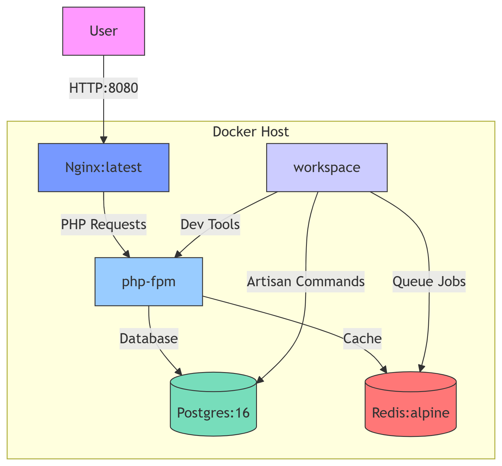
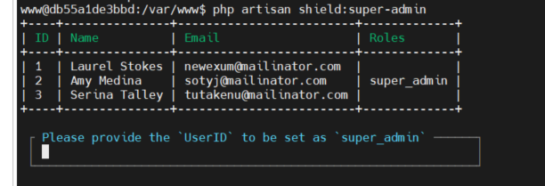

## Introduction
This is supposed to be a technical documentation which would cover design and setting up of the landregistry.gm prototype. Docker is a very popular container soluton which  simplifies app developement by making sure the app is portable accross different environment. It solves the problem of "it works on my system"

## Architecture

### Main Services

The prototype uses a multi-container Docker setup with the following main services:

1. **Nginx**: Acts as the web server and reverse proxy, handling HTTP requests and serving static files.
2. **PHP**: Runs the Laravel application code and processes backend logic.
3. **Workspace**: Provides a development environment with tools and utilities for running commands, installing dependencies, and managing the application.
4. **Redis**: An in-memory data store used for caching and queue management.
5. **Postgres**: The primary relational database for storing application data.

Each service runs in its own container, ensuring isolation and easier management.

### Database Schema

The following diagram illustrates the core database schema for the landregistry.gm prototype:


This schema covers the main entities such as properties, owners, documents, transactions, and their relationships. It serves as a reference for understanding how data is structured and interconnected within the application.

## Setting up dev env
Follow the steps here https://docs.docker.com/engine/install/ubuntu/
1. Install Docker and Docker compose
```bash
sudo apt install -y docker-ce docker-ce-cli containerd.io docker-compose-plugin

docker --version
docker compose version
```

2. Clone the repository
```bash
git clone https://github.com/Land-Registry-GM/landregistry.gm.git
cd landregistry.gm
cp .env.example .env
```

4. You may have to adjust the UID and GID variables in the .env file to match your user ID and group ID in the terminal.

```bash
 id -u
 id -g
```

## Starting the Application

### 1. Start Docker Compose Services

```bash
docker compose -f compose.dev.yaml up -d
```
Go through the env file and update APP_URL 
Generate key and update APP_KEY using the command below, the .env file will be updated with the generated key.
```bash 
docker compose -f compose.dev.yaml exec workspace php artisan key:generate
```

### 2. Install Laravel and Frontend Dependencies

Enter the workspace container:

```bash
docker compose -f compose.dev.yaml exec workspace bash
```

#### a. Install PHP Dependencies

Run the following command to install PHP dependencies using Composer:

```bash
composer install
```
This command reads the `composer.json` file and installs all required PHP packages for the Laravel application.

#### b. Install Frontend Dependencies

Install JavaScript and CSS dependencies using npm:

```bash
npm install
```
This command downloads and installs all frontend packages listed in `package.json`, such as Vue.js, React, or Tailwind CSS.

#### c. Build Frontend Assets

Compile and bundle frontend assets for development:

```bash
npm run dev
```
This command processes and builds your frontend assets (JavaScript, CSS, etc.) so they are ready to be served by the application.

### 3. Run Database Migrations

```bash
docker compose -f compose.dev.yaml exec workspace php artisan migrate
```

### 4. Access the Application

Open your browser and go to [http://localhost](http://localhost).


# Some useful commands

- **Access Workspace**: Open a shell in the workspace container.  
    ```bash
    docker compose -f compose.dev.yaml exec workspace bash
    ```
- **Execute commands directly**: Execute Laravel database migrations.  
    ```bash
    docker compose -f compose.dev.yaml exec workspace php artisan migrate
    ```
- **Rebuild Containers**: Rebuild and restart all Docker containers.  Useful for when you make changes to the Dockerfile or .env file.
    ```bash
    docker compose -f compose.dev.yaml up -d --build
    ```
- **Stop Containers**: Stop and remove all running containers.  
    ```bash
    docker compose -f compose.dev.yaml down
    ```
- **View Logs**: Show real-time logs from all containers.  
    ```bash
    docker compose -f compose.dev.yaml logs -f
    ```
- **View Web Logs**: Show logs for the web service only.  
    ```bash
    docker compose -f compose.dev.yaml logs -f web
    ```


## Filament Reference
https://filamentphp.com/docs/2.x/admin/resources/getting-started

### Create Resource
php artisan make:filament-resource Property


### Relationship managers
```php
php artisan make:filament-relation-manager PropertyResource owners title
php artisan make:filament-relation-manager PropertyResource documents title
php artisan make:filament-relation-manager PropertyResource legalEncumbrances title
php artisan make:filament-relation-manager PropertyResource transactions title
php artisan make:filament-relation-manager PropertyResource taxRecords title
php artisan make:filament-relation-manager PropertyResource surveys title
php artisan make:filament-relation-manager PropertyResource permits title
php artisan make:filament-relation-manager PropertyResource disputes title
```

### many to many relationship
```php
php artisan make:migration create_property_owner_table
```


### Filament Resources & CRUD operation very simplified
```php
php artisan make:filament-resource Owner
php artisan make:filament-resource Property
```

### Install Filament Shield for Permissions

To add role and permission management to your Filament admin panel, install and set up the Filament Shield package:

```bash
composer require bezhansalleh/filament-shield
```
```bash
# Publish the Filament Shield config file
php artisan vendor:publish --tag="filament-shield-config"

# Install and set up Filament Shield without Tenancy
php artisan shield:setup

# Install Panel
php artisan shield:install auth #replace auth with your authentication url this can be sometime be admin.

```
Now when you refresh the page you should see the Filament Shield installed. If you don't see one. You can configure your account to be super admin by followin steps below. 

```
php artisan shield:super-admin
```


then choose the super admin user, once you login at that user you will see the filament shield panel.

### Generate Permissions and Publish Policies

After installing and setting up Filament Shield, you can generate permissions for all resources and publish policy files using the following commands:

```bash
php artisan shield:generate --all
```
This command scans your Filament resources and generates all necessary permissions (view, create, update, delete, etc.) for them.

```bash
php artisan shield:publish auth
```
This command publishes the policy files for the `auth` guard, allowing you to customize authorization logic for your resources.


### Activity Log

We are using Spatie activity log to log all events of all models for auditing.

#### Install and Set Up Spatie Activity Log

```bash
composer require spatie/laravel-activitylog
```

Publish the config and migration files:

```bash
php artisan vendor:publish --provider="Spatie\Activitylog\ActivitylogServiceProvider" --tag="activitylog-migrations"
php artisan vendor:publish --provider="Spatie\Activitylog\ActivitylogServiceProvider" --tag="activitylog-config"
```

Run the migration to create the `activity_log` table:

```bash
php artisan migrate
```

Refer to the [Spatie Activitylog documentation](https://spatie.be/docs/laravel-activitylog/v4/introduction) for further configuration and usage.


can different people owning the same land have different type of ownership e.g. one has Freehold and the other have Lease ownership?


### Troubleshooting

docker compose -f compose.dev.yaml exec workspace php artisan key:generate

### Questions and Minutes
https://hackmd.io/@R_RNgefpQzWmm6RR3WWS9w/S1lKUWqGge/edit

### Some issues
1. Auditing, keeping track of changes
2.

